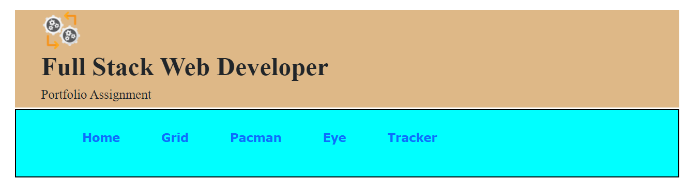

# 1. Project Title: Landing page
    This is landing page that describes projects and contains links repositories. Below is partial view of landing page
    
     1. Profile files:
         fikrubio/imgs/columbus.JPG
         fikrubio/imgs/favicon.JPG
         fikrubio/imgs/fikrubio.png
         fikrubio/index.html
     2. Eye
         eyes.js
         index.html
         styles.css
     3. Pacman
         pacman/imgs/pacman1.png
         pacman/imgs/pacman2.png
         pacman/imgs/pacman3.png
         pacman/imgs/pacman4.png
         pacman/js/pacman.js
         pacman/index.html        
     5. Real Time Bus Tracker
         busstops/index.html
         busstops/script.js
         busstops/styles.css
         busstops/vehicles.js
# 2. Motivation
    This is learning setup. This application could not accomplish anything beneficial than learning. 
# 3. Build Status
   This project currently tested on some in chrome browser and working as expected. However, this doesn’t mean that somebody could use this code to accomplish anything practical in business world. 
# 4. Code Style
   Applied coding style that is recommended for Java HTML, CSS, and JavaScript
# 5. Tech/Framework used
    HTML5/CSS5/JavaScript 2020 are frameworks used for developing this code
# 6. Installation
   Installation of this project is simple. It doesn't require specialized server to run this service. It can run on Linux, Window, Mac or other similar platforms as HTML/CSS/JAVASCRIPT are language of the Internet. 
   However, for better performance, it should deploy to dedicated serve that run on cloud or inhouse environment.
# 7. API References
  Users can point to this service like this: https//userdomain:userport/uri/pacman.html
# 8. Tests
  This app needs additional test. It passed developer test. Integration or user test is remaining activity that will get performed when better features and functionality add to this app
# 9. How to Use
  Users connected to internet can call this application from any location in the world. Application endpoint could appear on google search;
# 10. Contribute
  This project will grow and need contribution from developers and subject matter experts. Particularly UI developers’ contribution is vital to make this project useful for others
# 11. Credit
 Several individuals are behind this project. Special thanks to MIT-xPRO Emeritus staff who sacrificed their time and knowledge while teaching and supporting students. There are students who contributed when
  working with this project. Special thanks go to all whom supported directly or indirectly for this project. I would not for get to thank Git Hub. Without GitHub, we would not learn this interesting subject.
  Git Hub provided us with platforms to store and run this application on their cloud server. Again, thank you GitHub making our life easier!!
# 12. License
  GitHub, MIT and others technology owners’ products/services/logs are their own.
