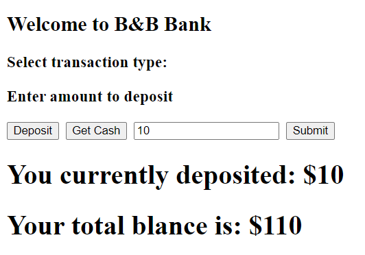

# 1. Project Title: ATMUserInterface

ATM user interface app is a UI developed to interact with users using React frame work. It allows users to deposit or withdraw money from their accounts. This is a modification to the ATM code that instructors shared in the learning module. It is refactored in way that shows account balance together with transaction type that is performed by the users. For example, when user withdraw money from their account, it shows amount withdrawn together with remaining balance on the account. Currently this app has some limitations. For example, is allows users to withdraw money when they have lessor zero account. This sees limitation but it is an alternative issuing credit card. In this mode users can withdraw money from the bank when they are in fact in deficit. It saves bank from issuing two cards: Credit and debit. Regardless of this, this app needs lots of upgrade and improvement to make user friendly. 
     1.ATMUserInterface
         atm_ui_js.js
         index.html
         atm_ui_styler.css
         atm_ui_ss.png
# 2. Motivation
    Learning React framework for developing UIs. ATM user interface app is an application of React Framework for desinging and developing user interface.
# 3. Build Status
   This project currently tested in chrome browser and working as expected. However, this doesn’t mean that somebody could use this code to accomplish anything practical in business world. 
# 4. Code Style
   Applied coding style that is recommended for Java HTML, CSS, and JavaScript and React
# 5. Tech/Framework used
    HTML5/CSS5/JavaScript/React library 2020 are frameworks used for developing this code
# 6. Installation
   Installation of this project is simple. It doesn't require specialized server to run this service. It can run on Linux, Window, Mac or other similar platforms as HTML/CSS/JAVASCRIPT/REACT are the most used tech for creating/developing UIs
   This app could simple install and start working if deployed server that NodeJs provides from out of the box.
# 7. API References
  Users can point to this service like this: https//userdomain:userport/uri/pacman.html
# 8. Tests
  This app needs additional test. It passed developer test. Integration or user test is remaining activity that will get performed when better features and functionality add to this app
# 9. How to Use
  Users connected to internet can call this application from any location in the world. Application endpoint could appear on google search;
# 10. Contribute
  This project will grow and need contribution from developers and subject matter experts. Particularly UI developers’ contribution is vital to make this project useful for others
# 11. License
  GitHub, MIT and others technology owners’ products/services/logs are their own.
