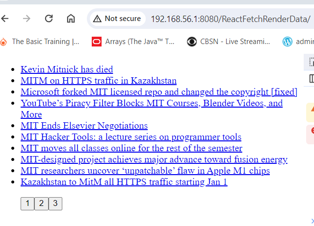

# 1. Project Title: Fetcher and Renderer

Fetch and Render service is one of vital coding exercise in my MERN training module. This UI, which is created using React components, fetches data from backend and render it to users in formatted and beautified manner. It fetches stories from various new anchors/feeders and render it to users on a paginated page. It is near to real world solution which could be easily adopted by business for internal use with their customers and employees. At this stage, this application is not completed or ready for use. I'm working on it to make it work as expected. I have added screenshot of issue i was facing when implementing the same code that works in training environment but not in my local setup. I’m working to resolve this issue.     
     1.Fetch and Render app artifacts:
         fetchAndRenderJs.js
         index.html
         fetchAndRenderCSS.css
         fetchAndRender_ui_ss.png
         README.md
# 2. Motivation
    Learning React framework for developing UIs. ATM user interface app is an application of React Framework for desinging and developing user interface.
# 3. Build Status
   This project currently tested in chrome browser and working as expected. However, this doesn’t mean that somebody could use this code to accomplish anything practical in business world. 
# 4. Code Style
   Applied coding style that is recommended for Java HTML, CSS, and JavaScript and React
# 5. Tech/Framework used
    HTML5/CSS5/JavaScript/React library 2020 are frameworks used for developing this code
# 6. Installation
   Installation of this project is simple. It doesn't require specialized server to run this service. It can run on Linux, Window, Mac or other similar platforms as HTML/CSS/JAVASCRIPT/REACT are the most used tech for creating/developing UIs
   This app could simple install and start working if deployed server that NodeJs provides from out of the box.
# 7. API References
  Users can point to this service like this: https//userdomain:userport/uri/pacman.html
# 8. Tests
  This app needs additional test. It passed developer test. Integration or user test is remaining activity that will get performed when better features and functionality add to this app
# 9. How to Use
  Users connected to internet can call this application from any location in the world. Application endpoint could appear on google search;
# 10. Contribute
  This project will grow and need contribution from developers and subject matter experts. Particularly UI developers’ contribution is vital to make this project useful for others
# 11. License
  GitHub, MIT and others technology owners’ products/services/logs are their own.
