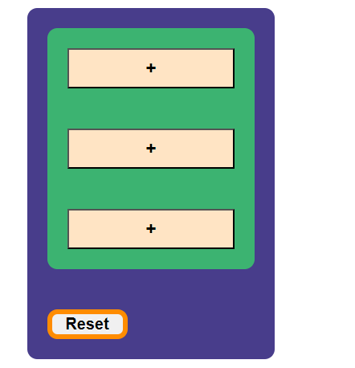

# 1. Project Title: React Tik Tak Toe Game
   
  
  
  # Description
    This is a simple user interface (web app) that built on REACT framework. Game player is expected to randomly hit lucky board to win the prize. If the player is lucky, he/she would win instantly. The build/development of this app is on progress. Current status is more of skeleton, which needs improvement in many aspects.
   
     1.React Tik Tak Toe Game
         tik_tak_toe_js.js
         tik_tak_toe_index.html
         tik_tak_toe_css.css
# 2. Motivation
    This is learning setup. . This app is on development phase and needs improvments
# 3. Build Status
   This project currently tested in chrome browser and working as expected. However, this doesn’t mean that somebody could use this code to accomplish anything practical in business world. 
# 4. Code Style
   Applied coding style that is recommended for Java HTML, CSS, and JavaScript
# 5. Tech/Framework used
    HTML5/CSS5/JavaScript/JSX 2021 are frameworks used for developing this code
# 6. Installation
   Installation of this project is simple. It doesn't require specialized server to run this service. It can run on Linux, Window, Mac or other similar platforms as HTML/CSS/JAVASCRIPT are language of the Internet. 
   However, for better performance, it should deploy to dedicated serve that run on cloud or inhouse environment.
# 7. API References
  Users can point to this service like this: https//userdomain:userport/uri/pacman.html
# 8. Tests
  This app needs additional test. It passed developer test. Integration or user test is remaining activity that will get performed when better features and functionality add to this app
# 9. How to Use
  Users connected to internet can call this application from any location in the world. Application endpoint could appear on google search;
# 10. Contribute
  This project will grow and need contribution from developers and subject matter experts. Particularly UI developers’ contribution is vital to make this project useful for others
# 11. License
  GitHub, MIT and others technology owners’ products/services/logs are their own.
